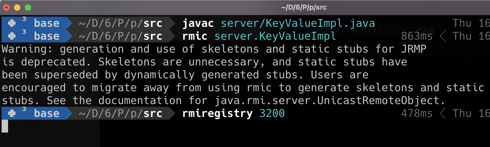
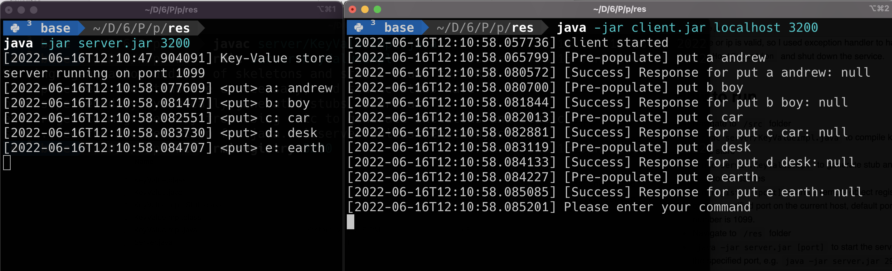
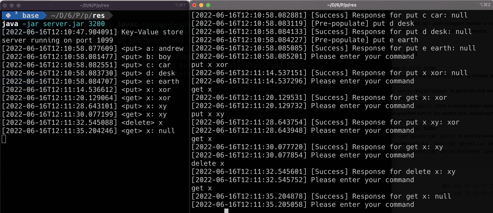

# CS6650 Project 2: Multi-threaded Key-Value Store using RPC

## Assignment Overview

In this assignment, we are asked to implement a remote key-value store using Remote Procedure
Calls (RPC). Data is stored in a hashmap. The server registers the key-value store using RMI, and
clients can call the key-value store remotely. There are threes types of requests supported: get(
key)
, put(key, value) and delete(key). The purpose of this assignment is to let us have a better
understanding of the mechanism of RPC and RMI. Also, I learned how a server works under the hood.
Nowadays, people are familiar with using back-end frameworks like Express, SpringBoot, but they may
not have a clear understanding of how exactly it works. This assignment helps me dive deep into the
logic beneath such frameworks. Also, designing relationships between classes improves my oop design
ability. And there are also a lot of edge cases to deal with, like checking if an ip and port is
valid, as well as handling erroneous requests and response.

## Technical impression

I first used the single-threaded server and client from project 1. Then I made `KeyValue` interface
extend `java.rmi.Remote` interface, and `KeyValueImpl` extend ` java.rmi.server.UnicastRemoteObject`
a `Logger` class to support RPC. After that, I replaced TCP/IP with rmi, and add a logger to
the `KeyValue` class, when an operation is executed, the key-value class would print it with the
logger. Then I searched online and found out that the concurrent map can handle mutual exclusion. So
I replaced `HashMap` with `ConcurrentHashMap`. Because all operations are called from the client, I
moved `checkRequest(String request)` function from server to client to check the validity of a
command. Then, I added a port argument in the server, and port and ip arguments in the client to
support custom ip and port. Lastly, I tested and built it into jar files.

## How to run

- Navigate to `/src` folder
- `javac server/KeyValueImpl.java` to compile key-value store
- `rmic server.KeyValueImpl` to generate stub and skeleton class files
- `rmiregistry [port]` starts a remote object registry on the specified port on the current host,
  default port number is 1099.
- Navigate to `/res` folder
- `java -jar server.jar [port] ` to start the server on the specified port,
  e.g. `java -jar server.jar 2999`
- `java -jar client.jar [ip or hostname] [port] ` to start the server on the specified port,
  e.g. `java -jar server.jar 2999`
- `Ctrl+C` to stop the process

## Examples with description

- start a remote object registry on port 3200
  
- start the client and server, client pre-populate some commands
  
- user enter some commands
  

## Assumption

- Key and value are string

## Limitation

- Key and value are string

## References

- [Concurrent Hash Map](https://www.javatpoint.com/hashmap-vs-concurrenthashmap-in-java)