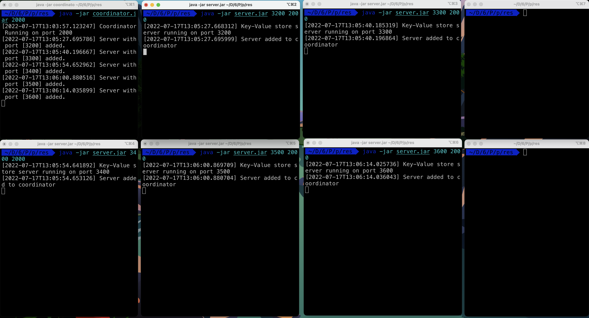
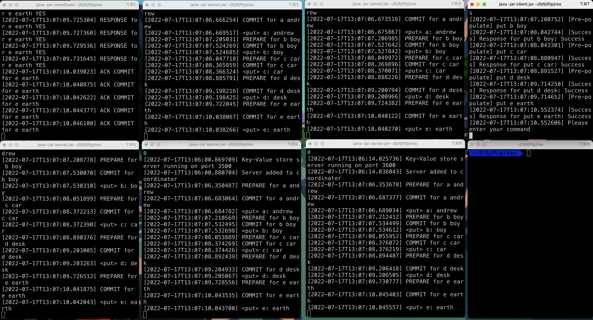
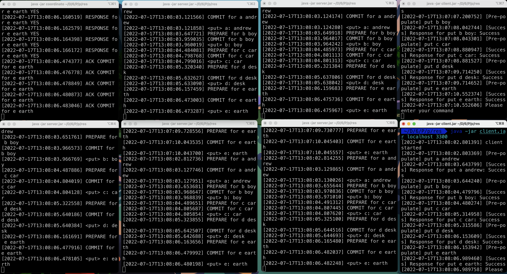
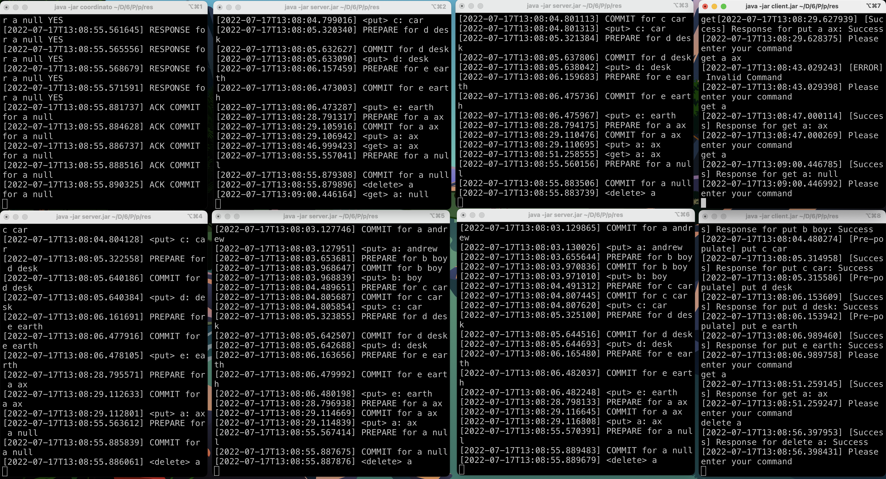
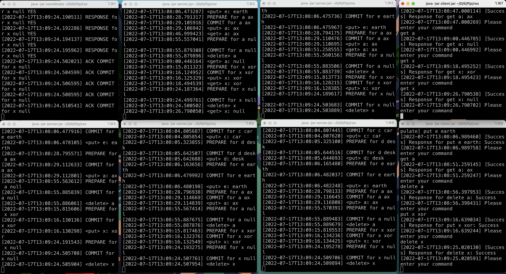
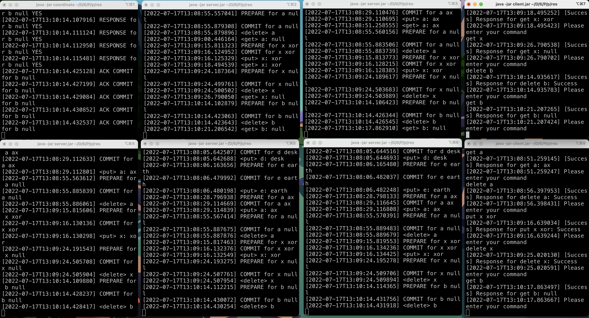
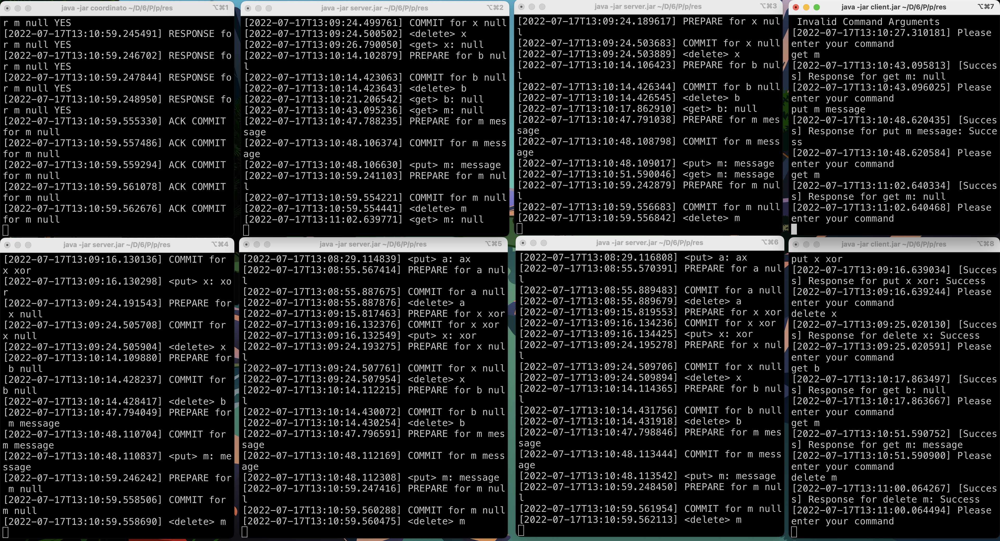

# CS6650 Project 3: Multi-threaded Key-Value Store using RPC

## Assignment Overview

In this assignment, we are asked to implement a multi-threaded remote key-value store using Remote Procedure
Calls (RPC). Data is stored in a concurrency hashmap. The coordinator uses Two-Phase Commit Protocol(2PC) to keep the
data consistent among all the servers. The server registers the key-value store using RMI, and
clients can call the key-value store remotely. When a server receives a put or delete request, it invokes the
coordinator, and the coordinator will check for all the servers to determine whether to commit this request or not
. There are threes types of requests supported: get(key), put(key, value) and delete(key). The purpose of this
assignment is to let us have a better
understanding of the mechanism of RPC and RMI. Also, I learned how a server works under the hood.
Nowadays, people are familiar with using back-end frameworks like Express, SpringBoot, but they may
not have a clear understanding of how exactly it works. This assignment helps me dive deep into the
logic beneath such frameworks. Also, designing relationships between classes improves my oop design
ability. And there are also a lot of edge cases to deal with, like checking if an ip and port is
valid, as well as handling erroneous requests and response.

## Technical impression

I first used the RMI server and client from project 2. Then I made `Coordinator` interface
extend `java.rmi.Remote` interface, and `CoordinatorImpl` class. After that, I updated the server to connect to the
coordinator with its port when a server is initialized. Then I followed 2PC and updated `put` and `get` request. When
such request is made by the client, the coordinator checks for all the servers to determine whether to commit this
request or not. If an operations is committed, it will be performed by all the servers to make data consistent. Also,
key steps are logged for servers to recovery from crash. A request will only be approved when the coordinator receives
acknowledgement from all the servers. Otherwise, it will be aborted. Lastly, I tested and built it into jar files.

## How to run

- Navigate to `/src` folder
- `javac -jar coordinator.jar [port]` to start the coordinator
- `javac -jar server.jar [port] [coordinator port]` to start the server and add server to coordinator
- `javac -jar client.jar [server hostname or ip] [server port]` to connect to the server
- `Ctrl+C` to stop the process

## Examples with description

1. start the coordinator on port 2000
   
2. start 5 servers on port 3200(1), 3300(2), 3400(3), 3500(4) and 3600(5). Add servers to the coordinator
   
3. start a clients and connect to sever 1, pre-populate some requests
   
4. start a clients and connect to sever 1, pre-populate some requests
   
5. example 1

- client 1 `put a ax`: Success
- client 1 `get a`: ax
- client 2 `get a`: ax
- client 2 `delete a`: Success
- client 1 `get a`: gets null
  

6. example 2

- client 2 `put x xor`: Success
- client 1 `get x`: xor
- client 2 `delete x`: Success
- client 1 `get x`: null
  

7. example 3

- client 1 `delete b`: Success
- client 1 `get b`: null
- client 2 `get b`: null
  

7. example 4

- client 1 `get m`: null
- client 1 `put m message`: Success
- client 2 `get m`: message
- client 2 `delete m`: Success
- client 1 `get m`: null
  

## Assumption

- Coordinator won't fail

## Limitation

- Key and value are string
- Processing time for put and delete request is long

## References

- [Concurrent Hash Map](https://www.javatpoint.com/hashmap-vs-concurrenthashmap-in-java)